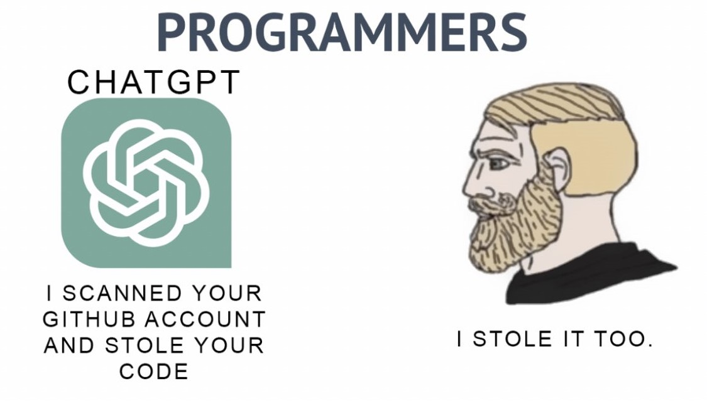

# RabbitMQ
RabbitMQ는 AMQP(Advanced Message Queuing Protocol)를 기반으로 한 오픈 소스 메시지 브로커 소프트웨어입니다. 메시지 지향 미들웨어(Message Oriented Middleware) 시스템으로서, 애플리케이션 간 메시지 전달 및 큐잉을 지원하여 시스템 간 통신을 쉽게 할 수 있습니다.

## 기본 개념
### Producer(생산자)
 - 메시지를 생성하고 RabbitMQ로 보내는 애플리케이션 또는 구성 요소입니다.
 - 메시지를 RabbitMQ에게 보내며, 이는 주로 큐(queue)라는 곳에 저장됩니다.
### Queue(큐)
 - 메시지가 보관되는 곳으로, 생산자가 생성한 메시지를 저장합니다.
 - 소비자(Consumer)가 메시지를 처리하기 전까지 대기합니다.
### Consumer(소비자)
 - RabbitMQ에서 메시지를 소비하고 처리하는 애플리케이션 또는 구성 요소입니다.
 - 큐에 있는 메시지를 읽어들여 작업을 수행합니다.
### Exchange(교환)
 - 생산자가 메시지를 전송하는 곳으로, 메시지를 큐에 라우팅하는 역할을 합니다.
 - 라우팅 규칙에 따라 메시지를 큐로 전송합니다.
### RabbitMQ의 특징
 - **유연한 라우팅 및 프로토콜 지원**: AMQP 및 다양한 라우팅 규칙을 지원하여 다양한 메시지 전달 방식을 지원합니다.
 - **클러스터링과 고가용성**: 클러스터링을 지원하여 고가용성 및 확장성을 제공합니다.
 - **다양한 플러그인과 확장 기능**: 다양한 플러그인을 통해 기능을 확장하고 커스터마이징할 수 있습니다.
## RabbitMQ 사용 사례
 - 서비스 간 통신
 - 비동기 작업 처리
 - 이벤트 기반 아키텍처 구현

RabbitMQ는 메시지 지향 미들웨어 시스템으로, 다양한 애플리케이션 및 서비스 간의 효율적인 통신을 가능하게 하며, 대기열(Queue)을 통한 메시지 처리를 지원하여 안정적인 시스템 통합을 도와줍니다.

ChatGPT3.5를 사용하여 학습주제 선정, 코드 작성, README 작성을 수행했습니다.

